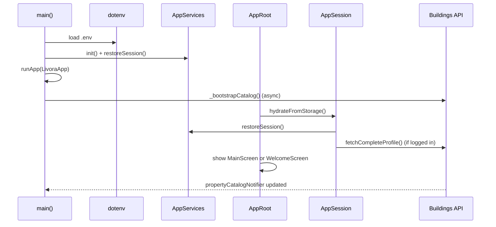
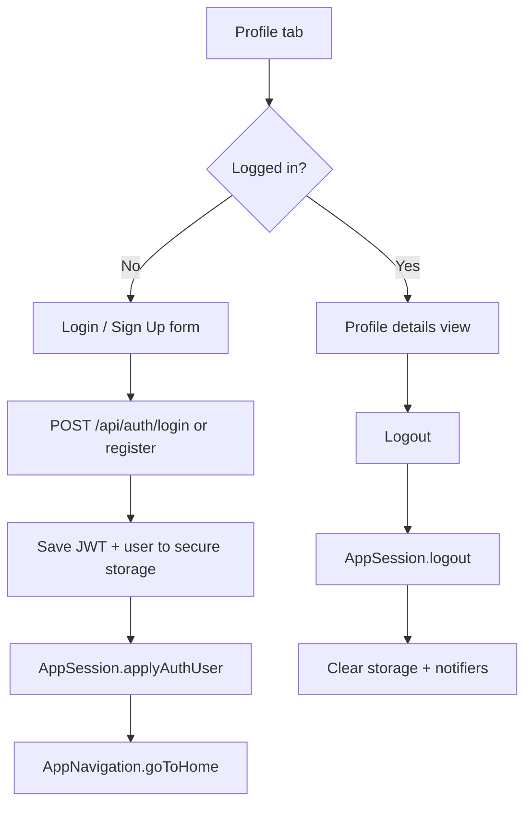
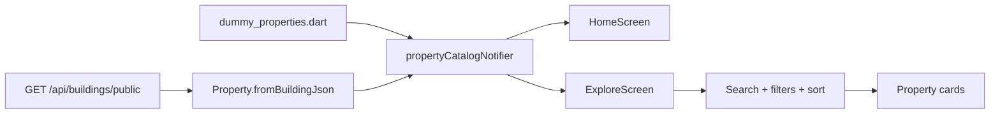
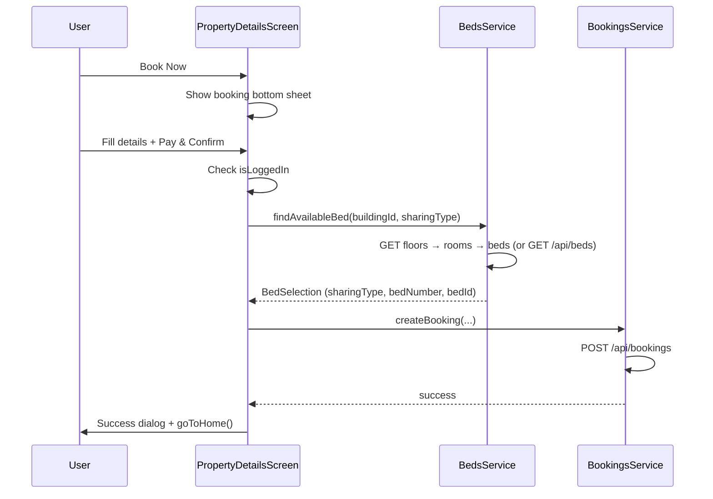

# Livora Hostel Hub — Project Flow & Architecture

Complete guide to how the Flutter app is structured, how data flows, and how each user journey works end-to-end.

**Backend API:** `https://livora-hostel-hub-1.onrender.com` (configurable via `.env`)  
**Web tenant reference UI:** `livora-hostel-hub-tenant.vercel.app/search`

---

## Table of contents

1. [Overview](#1-overview)
2. [Tech stack](#2-tech-stack)
3. [Project structure](#3-project-structure)
4. [Architecture layers](#4-architecture-layers)
5. [App startup flow](#5-app-startup-flow)
6. [Navigation model](#6-navigation-model)
7. [Global state](#7-global-state)
8. [Screen flows](#8-screen-flows)
9. [Authentication flow](#9-authentication-flow)
10. [Property discovery flow](#10-property-discovery-flow)
11. [Property details & booking flow](#11-property-details--booking-flow)
12. [Resident portal flow](#12-resident-portal-flow)
13. [API integration](#13-api-integration)
14. [Data models](#14-data-models)
15. [Offline & fallback behavior](#15-offline--fallback-behavior)
16. [Environment & setup](#16-environment--setup)
17. [Build targets](#17-build-targets)
18. [Known gaps & demo features](#18-known-gaps--demo-features)

---

## 1. Overview

**Livora Hostel Hub** is a cross-platform Flutter app for:

- Browsing and searching hostels/PGs
- Viewing rich property details (occupancy, beds, amenities, pricing, rules)
- Booking beds (authenticated)
- Managing tenant profile, wishlist, and resident portal features

Most UI lives in `lib/main.dart` (~5,600 lines). Business logic, networking, and storage are split into `lib/app/`, `lib/core/`, `lib/services/`, and `lib/models/`.

```
┌─────────────────────────────────────────────────────────────┐
│                        LivoraApp                            │
│  MaterialApp → navigatorKey + scaffoldMessengerKey          │
└──────────────────────────┬──────────────────────────────────┘
                           │
              ┌────────────▼────────────┐
              │        AppRoot          │
              │  hydrate session        │
              └────────────┬────────────┘
                           │
         ┌─────────────────┴─────────────────┐
         │                                   │
   not logged in                      logged in OR
         │                          guest via Welcome
         ▼                                   ▼
  WelcomeScreen                        MainScreen
  (onboarding)                    (5-tab bottom nav)
```

---

## 2. Tech stack

| Layer | Technology |
|-------|------------|
| Framework | Flutter 3.x (Dart SDK `>=3.8.0 <4.0.0`) |
| HTTP | Dio 5.x |
| Config | flutter_dotenv (`.env`) |
| Secure storage | flutter_secure_storage (JWT + profile) |
| Images | image_picker, custom `PropertyImage` + `ImageResolver` |
| External links | url_launcher (WhatsApp FAB) |
| Icons | Material Icons + Font Awesome |

---

## 3. Project structure

```
hostelhub2/
├── .env                    # Runtime API URL (not committed)
├── .env.example            # Template for BASE_URL / SOCKET_URL
├── docs/
│   ├── API_REFERENCE.md    # REST endpoint table
│   └── PROJECT_FLOW.md     # This document
├── assets/images/          # Fallback property images
├── lib/
│   ├── main.dart           # All screens + app entry (monolithic UI)
│   ├── app/
│   │   ├── app_services.dart    # Service locator / init
│   │   ├── app_state.dart       # Global ValueNotifiers
│   │   ├── app_navigation.dart  # Tab + root navigator helpers
│   │   └── app_session.dart     # Login/profile sync
│   ├── core/
│   │   ├── config/env_config.dart
│   │   ├── network/api_client.dart
│   │   ├── network/api_endpoints.dart
│   │   ├── storage/secure_storage_service.dart
│   │   └── utils/api_exception.dart, image_resolver.dart
│   ├── data/dummy_properties.dart   # Offline catalog fallback
│   ├── models/
│   │   ├── property.dart
│   │   └── auth_user.dart
│   ├── services/               # One service per API domain
│   │   ├── auth_service.dart
│   │   ├── buildings_service.dart
│   │   ├── beds_service.dart
│   │   ├── bookings_service.dart
│   │   ├── payments_service.dart
│   │   ├── complaints_service.dart
│   │   ├── tenant_portal_service.dart
│   │   └── notifications_service.dart
│   └── widgets/
│       ├── hostel_full_details_view.dart  # Full property details UI
│       └── property_image.dart
└── android/ ios/ web/ macos/ linux/ windows/   # Platform runners
```

---

## 4. Architecture layers

```
┌──────────────────────────────────────────────────┐
│  UI Layer (main.dart + widgets/)                 │
│  Screens, dialogs, bottom sheets                 │
└────────────────────┬─────────────────────────────┘
                     │ calls
┌────────────────────▼─────────────────────────────┐
│  App Layer (app/)                                │
│  AppServices, AppSession, AppNavigation, state   │
└────────────────────┬─────────────────────────────┘
                     │ uses
┌────────────────────▼─────────────────────────────┐
│  Service Layer (services/)                       │
│  Auth, Buildings, Beds, Bookings, etc.           │
└────────────────────┬─────────────────────────────┘
                     │ via
┌────────────────────▼─────────────────────────────┐
│  Core Layer (core/)                              │
│  ApiClient (Dio), endpoints, storage, env        │
└────────────────────┬─────────────────────────────┘
                     │
┌────────────────────▼─────────────────────────────┐
│  Livora Backend API (Render)                     │
└──────────────────────────────────────────────────┘
```

### Service locator — `AppServices`

Initialized once in `main()`:

```dart
await AppServices.init();
// Creates: secureStorage, apiClient, auth, buildings, beds,
//          bookings, payments, complaints, tenantPortal, notifications
await auth.restoreSession();
```

401 responses trigger automatic logout and redirect to Profile sign-in.

---

## 5. App startup flow



### Step-by-step

1. **`WidgetsFlutterBinding.ensureInitialized()`**
2. **Load `.env`** → `BASE_URL`, `SOCKET_URL`
3. **`AppServices.init()`** — wire Dio, storage, all services; restore JWT
4. **Register 401 handler** — logout + go to Profile tab
5. **`runApp(LivoraApp)`** — `home: AppRoot`
6. **`_bootstrapCatalog()`** (background):
   - `GET /api/buildings/public` → `propertyCatalogNotifier`
   - `GET /api/buildings/public/stats` → `platformStatsNotifier`
   - On failure → keep `allDummyProperties`

### `AppRoot` routing

| Condition | Screen |
|-----------|--------|
| Session hydrating | Loading spinner |
| `auth.isLoggedIn == true` | `MainScreen` |
| Not logged in | `WelcomeScreen` |

**Note:** Guests can tap **Explore Hostels** on Welcome to enter `MainScreen` without logging in.

---

## 6. Navigation model

### Two navigation systems

1. **Bottom tab shell** — `mainTabIndexNotifier` (0–4) switches pages inside `MainScreen`
2. **Root stack** — `navigatorKey` for pushed routes (e.g. `PropertyDetailsScreen`)

### Tab indices (`AppNavigation`)

| Index | Tab | Screen |
|-------|-----|--------|
| 0 | Home | `HomeScreen` |
| 1 | Explore | `ExploreScreen` |
| 2 | Portal | `ResidentPortalScreen` |
| 3 | Saved | `SavedScreen` |
| 4 | Profile | `ProfileScreen` |

### Navigation helpers

| Method | Behavior |
|--------|----------|
| `AppNavigation.goToTab(n)` | Switch bottom tab |
| `AppNavigation.goToHome()` | Tab 0 + pop all routes to root |
| `AppNavigation.goToProfileSignIn()` | Tab 4 + pop to root |
| `AppNavigation.promptSignIn(msg)` | Snackbar + redirect to Profile |

### Floating action button

WhatsApp support link (`wa.me/919876543213`) on all main tabs.

---

## 7. Global state

Defined in `lib/app/app_state.dart` and `lib/main.dart`:

| Notifier | Type | Purpose |
|----------|------|---------|
| `mainTabIndexNotifier` | `int` | Active bottom tab |
| `propertyCatalogNotifier` | `List<Property>` | Hostel catalog (API or dummy) |
| `platformStatsNotifier` | `PlatformStats?` | Tenants/properties/cities stats |
| `savedPropertiesNotifier` | `Set<Property>` | Local wishlist (in-memory) |
| `savedNameNotifier` | `String?` | Display name |
| `savedEmailNotifier` | `String?` | Email |
| `savedPhoneNotifier` | `String?` | Phone |
| `savedEmergencyNameNotifier` | `String?` | Emergency contact |
| `savedEmergencyPhoneNotifier` | `String?` | Emergency phone |
| `profileImageNotifier` | `XFile?` | Local profile photo |
| `AppServices.auth.isLoggedIn` | `bool` | JWT session flag |

**Persistence:** JWT + user id/role/name/email/phone → `flutter_secure_storage`. Wishlist is **not** synced to API by default (tenant wishlist API exists but Saved tab uses local notifier).

---

## 8. Screen flows

### 8.1 WelcomeScreen

- Animated onboarding for **Livora**
- **Explore Hostels** → `Navigator.pushReplacement(MainScreen)` + `goToHome()`
- Does not require login

### 8.2 HomeScreen

- Search bar with filters (location, category, price)
- Platform stats banner (from API when available)
- Featured properties, categories, trending list
- Quick SOS banner, refer & earn card
- Tapping a property → `PropertyDetailsScreen` (standard mode)

### 8.3 ExploreScreen

- Full catalog with search, filters, sort, map/list toggle
- Filters: location, max price, AC/Non-AC, sort by price/rating
- Property cards show: image, price, occupancy, tags, **View Details**, **Book Now**

| Button | Navigation |
|--------|------------|
| View Details | `PropertyDetailsScreen(fullDetailsMode: true)` |
| Book Now | `PropertyDetailsScreen(openBookingOnStart: true)` |

### 8.4 PropertyDetailsScreen

Three modes via constructor flags:

| Flag | Effect |
|------|--------|
| `fullDetailsMode: true` | Shows `HostelFullDetailsView` (single scrollable details page) |
| `openBookingOnStart: true` | Opens booking bottom sheet immediately |
| (default) | Standard property page: virtual tour, rent, amenities, reviews, etc. |

On init, fetches `GET /api/buildings/public/:id` for full building JSON.

### 8.5 SavedScreen

- Local wishlist from `savedPropertiesNotifier`
- Remove heart → updates set
- Tap item → `PropertyDetailsScreen`

### 8.6 ProfileScreen

Dual mode via `AppServices.auth.isLoggedIn`:

- **Not logged in** → Login / Sign Up form (`_buildAuthView`)
- **Logged in** → Profile details, digital ID, booking history, logout (`_buildProfileDetailsView`)

Also supports:
- Profile photo upload → `POST /api/tenant-portal/upload-photo`
- Phone OTP verification (demo/local — see §18)
- Emergency contact fields

### 8.7 ResidentPortalScreen

Tenant dashboard (mostly UI mockups + sheets):

- Quick actions: Outpass, Complaint, Rent, Mess
- Digital ID card, active pass, notice board
- Complaint tracker, mess menu, help & support
- Bottom sheets for each action (local UI; some can call API services)

### 8.8 Other screens

| Screen | Purpose |
|--------|---------|
| `PaymentProcessingScreen` | Rent payment UI flow |
| `CategoryScreen` | Filtered list by category (Men's/Women's/Co-living) |

---

## 9. Authentication flow



### Login

```
POST /api/auth/login
Body: { email, password }
Response: { token, user: { _id, name, email, role } }
```

### Register

```
POST /api/auth/register
Body: { name, email, password, phone, role: "TENANT" }
```

### Session restore

On cold start:

1. Read token from secure storage
2. If present → `isLoggedIn = true`
3. `AppSession.hydrateFromStorage()` loads name/email/phone
4. Optionally refreshes from `GET /api/tenant-portal/complete-profile`

### Unauthorized (401)

Dio interceptor → `AppSession.logout()` → Profile sign-in tab.

### Phone OTP (Profile)

- **Demo only:** generates 6-digit OTP locally, shows in Snackbar
- On success → saves profile notifiers → `goToHome()`
- Not connected to backend SMS

---

## 10. Property discovery flow



### API → UI mapping (`Property.fromBuildingJson`)

| API field | Property field |
|-----------|----------------|
| `_id` | `id` |
| `name` | `title` |
| `locationCity` + `address` | `location` |
| `startingPrice` | `price` |
| `rating` | `rating` |
| `images[0]` | `imageUrl` (via `ImageResolver`) |
| `amenities[]` | `tags` |
| `genderType` | `category` (Men's/Women's/Co-living) |

---

## 11. Property details & booking flow

### Full details (View Details)

```
Explore → View Details
  → PropertyDetailsScreen(fullDetailsMode: true)
  → GET /api/buildings/public/:id
  → HostelFullDetailsView renders sections:
      Overview, Building & Security, Smart Safety, Nearby,
      Room types, Dimensions, Beds, Roommate compat, Facilities,
      Bathroom, Dining, Community, Pricing table, House rules
```

Some sections use API data (`policies`, `smartConfig`, `floors`, `draftData`, rents); others use sensible defaults (nearby distances, roommate text) when API lacks fields.

### Booking (Book Now)



### Booking payload (required fields)

```json
{
  "buildingId": "...",
  "bedId": "...",
  "category": "Standard | Premium",
  "moveInDate": "YYYY-MM-DD",
  "totalAmount": 60000,
  "securityDeposit": 10000,
  "onboardingFee": 999,
  "method": "UPI | Bank Transfer",
  "guestName": "...",
  "email": "...",
  "phone": "...",
  "sharingType": "Single | Double | Triple",
  "bedNumber": "1",
  "bedFilling": {
    "sharingType": "Double",
    "bedNumber": "1"
  }
}
```

### Bed resolution (`BedsService`)

1. `GET /api/floors/building/:buildingId`
2. For each floor: `GET /api/rooms/:floorId`
3. Find first bed with status `AVAILABLE` / `VACANT` / `FREE` matching sharing type
4. Fallback: `GET /api/beds?buildingId=&status=vacant`
5. Last resort: `BedsService.fallback(sharingType)` → bedNumber `"1"`

Room label → sharing type mapping:

| UI label | API sharingType |
|----------|-----------------|
| Single | Single |
| Double Sharing / 2 Sharing | Double |
| 3-Sharing / Triple | Triple |

---

## 12. Resident portal flow

Designed for logged-in tenants. Key API-backed capabilities (via services):

| Feature | Service | Endpoint |
|---------|---------|----------|
| Full profile | TenantPortalService | `GET /tenant-portal/complete-profile` |
| Photo upload | TenantPortalService | `POST /tenant-portal/upload-photo` |
| Community reports | TenantPortalService | POST/GET community-reports |
| SOS alerts | TenantPortalService | POST sos-alerts |
| Wishlist (API) | TenantPortalService | GET/POST wishlist |
| Rewards | TenantPortalService | GET rewards/me |
| Rent payments | PaymentsService | GET/POST payments |
| Complaints | ComplaintsService | GET/POST complaints |
| Notifications | NotificationsService | GET/PATCH notifications |

Much of the Portal UI (outpass, mess menu, notices) is **presentational** with local mock data in `main.dart`.

---

## 13. API integration

### HTTP client (`ApiClient`)

- Base URL from `EnvConfig.baseUrl`
- Timeouts: connect 15s, receive 30s
- Request interceptor: attaches `Authorization: Bearer <token>`
- Error interceptor: 401 → logout callback

### Endpoint summary

See full table in [`docs/API_REFERENCE.md`](./API_REFERENCE.md).

**Public (no auth):**

- `GET /api/buildings/public`
- `GET /api/buildings/public/:id`
- `GET /api/buildings/public/stats`
- `POST /api/auth/login`, `POST /api/auth/register`

**Protected (Bearer token):**

- Bookings, payments, complaints, tenant portal, notifications, beds/floors/rooms (for bed lookup)

### Images

Paths like `/uploads/...` are prefixed with `BASE_URL` in `ImageResolver`.

---

## 14. Data models

### `Property`

UI model for hostel cards and detail headers. Built from API via `fromBuildingJson()` or from dummy data.

### `AuthUser`

`id`, `name`, `email`, `role` (default `TENANT`).

### `PlatformStats`

`tenants`, `properties`, `cities`, `rating` — from public stats endpoint.

### `BedSelection`

Internal booking helper: `sharingType`, `bedNumber`, optional `bedId`.

### Raw building details

`fetchPublicBuildingDetails()` returns full `Map<String, dynamic>` including:

- `policies`, `staffInfo`, `smartConfig`, `draftData`
- `floors[]` → `rooms[]` → `beds[]`
- `rentSingle`, `rentDouble`, `rentTriple`, `securityDeposit`, etc.

---

## 15. Offline & fallback behavior

| Scenario | Behavior |
|----------|----------|
| API unreachable at startup | Keep `allDummyProperties` (~20 hostels in `dummy_properties.dart`) |
| Building has no `_id` | Booking blocked with snackbar |
| Bed lookup fails | Uses `BedsService.fallback()` |
| Profile fetch fails after login | Keeps secure-storage values |
| 401 on any request | Logout + Profile tab |

---

## 16. Environment & setup

```bash
cp .env.example .env
flutter pub get
flutter run              # default device
flutter run -d chrome    # web
flutter build apk --release
```

`.env`:

```env
BASE_URL=https://livora-hostel-hub-1.onrender.com
SOCKET_URL=https://livora-hostel-hub-1.onrender.com
```

**Android note:** If `gradlew` fails with macOS quarantine after download:

```bash
xattr -dr com.apple.quarantine android
```

---

## 17. Build targets

Supported platforms (standard Flutter project):

- **Android** — `android/`
- **iOS** — `ios/`
- **Web** — `web/` (used for `flutter run -d chrome`)
- **macOS / Linux / Windows** — desktop runners present

Primary brand color: `#4F46E5` (indigo).

---

## 18. Known gaps & demo features

Features that are **UI-first** or **local-only** today:

| Feature | Status |
|---------|--------|
| Phone OTP verification | Demo OTP in snackbar; not SMS/API |
| Saved / Wishlist tab | In-memory `savedPropertiesNotifier`; API wishlist exists but not wired to Saved tab |
| Resident portal notices, mess, outpass | Mostly static/mock UI |
| Nearby transit distances in full details | Hardcoded defaults in `HostelFullDetailsView` |
| Room dimensions / roommate compatibility | Defaults when not in API |
| Virtual tour | Local overlay UI, not 360° API |
| Socket.io notifications | `SOCKET_URL` in env; not implemented in app yet |
| Hot reload after widget constructor changes | Requires **hot restart (`R`)** not hot reload |

---

## Quick reference — user journeys

### Guest browse

```
Welcome → Explore Hostels → MainScreen (Home)
→ Explore tab → View Details → full details scroll
```

### Book a hostel

```
Explore → Book Now → booking sheet
→ (must login) → BedsService → BookingsService → success → Home
```

### Login & return visit

```
Profile → Login → API → JWT stored
→ App restart → AppRoot → MainScreen (skip Welcome)
```

### Session expired

```
Any API 401 → logout → Profile sign-in tab
```

---

## Related docs

- [`docs/API_REFERENCE.md`](./API_REFERENCE.md) — REST endpoints
- [`README.md`](../README.md) — Setup quick start

---

*Generated from codebase analysis of `hostelhub2` — Livora Hostel Hub Flutter app.*
